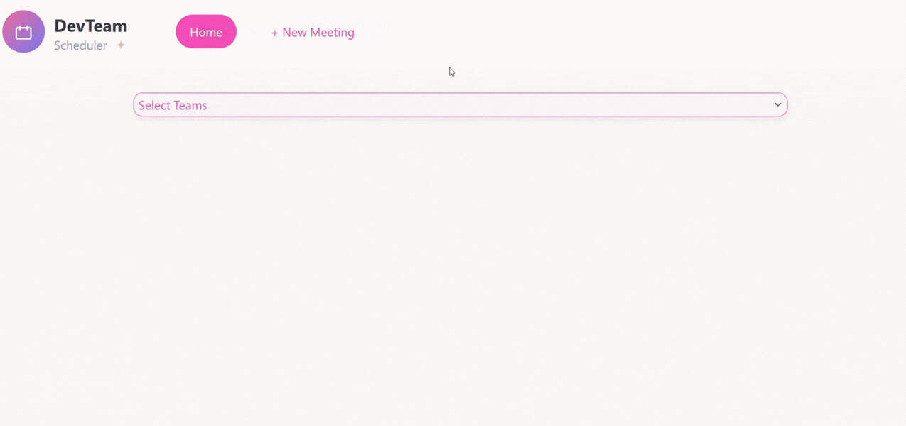

# 📅 Development Group Meeting System

A Full Stack application designed for managing and viewing team meetings.
The system allows users to filter and view scheduled meetings for specific development groups and easily book new meetings through a clean and intuitive interface.




## 🛠️ Tech Stack

**Client:**


**Server & Database:**


## ✨ Key Features

- 🔍 **Smart Filtering:** View meetings filtered by specific Development Groups.
- ➕ **Schedule Meetings:** A user-friendly form to create and book new meetings.
- 🎨 **Clean UI:** Designed with Bootstrap and custom CSS for a clear and responsive user experience.
- 📱 **Dynamic View:** Real-time updates of the meeting list based on the selected group.

## 🚀 Future Improvements (Roadmap)

- [ ] Implement User Authentication (Login/Register).
- [ ] Add conflict validation (prevent double booking of the same room/time).
- [ ] Enable editing and deleting of existing meetings.

## 📸 Screenshots

|            Group Filter View            |              Add Meeting Form              |
| :-------------------------------------: | :-----------------------------------------: |
|  |  |

## ⚙️ Installation & Setup

To run this project locally, follow these steps:

### 1. Clone the Repository

```bash
git clone https://github.com/amoryossef/dev-team-scheduler.git
cd dev-team-scheduler
```

### 2. Server Setup

```bash
cd server
npm install
# Ensure your .env file is configured with your MySQL credentials
npm start
```

### 3. Client Setup

**Bash**

```
cd client
npm install
npm run dev
```

### 4. Database Setup

Run the provided SQL script located in the `database` folder to create the necessary tables and insert initial data.

---

### 📬 Contact

Created by  **Ayala Mor Yossef** .
LinkedIn: [linkedin.com/in/ayala-m-8885a3395](https://www.linkedin.com/in/ayala-m-8885a3395)
Email: ayala21717@gmail.com
